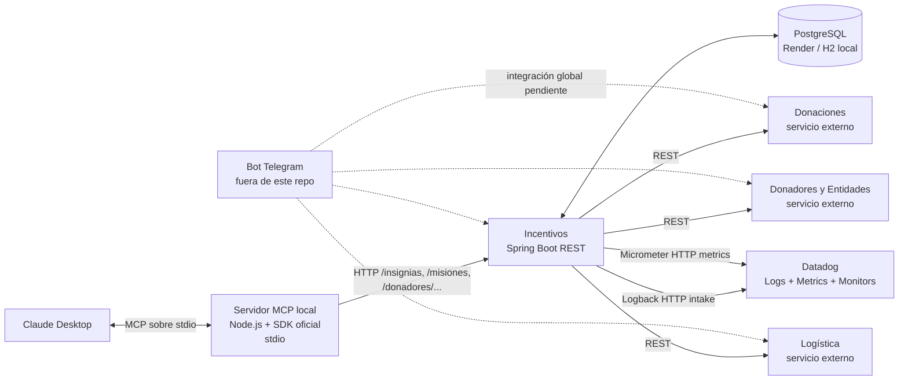

# Arquitectura propuesta — Entrega 5

Este diagrama extiende el componente Incentivos con el MCP local y observabilidad. Los servicios que no están en este repositorio se muestran como dependencias externas; verificar sus URLs/contratos con el equipo.

## Límites de implementación

- El proceso MCP es local y solo expone herramientas del dominio Incentivos. Las herramientas llaman a la API REST y no duplican reglas de negocio.
- El MCP usa `INCENTIVOS_API_URL` para elegir la API local o el despliegue.
- El bot, los otros tres repositorios y la topología real de sus bases/despliegues no están incluidos en este workspace; el diagrama no afirma que esas integraciones estén desplegadas o verificadas.
