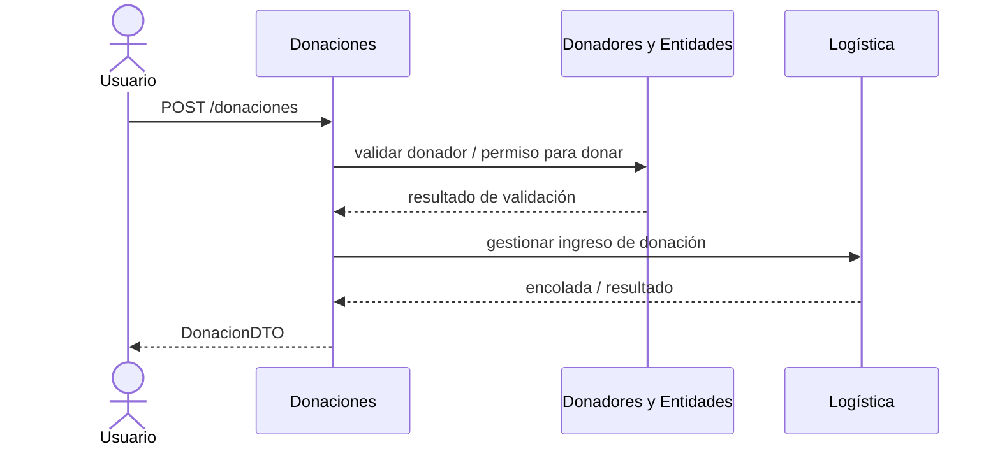
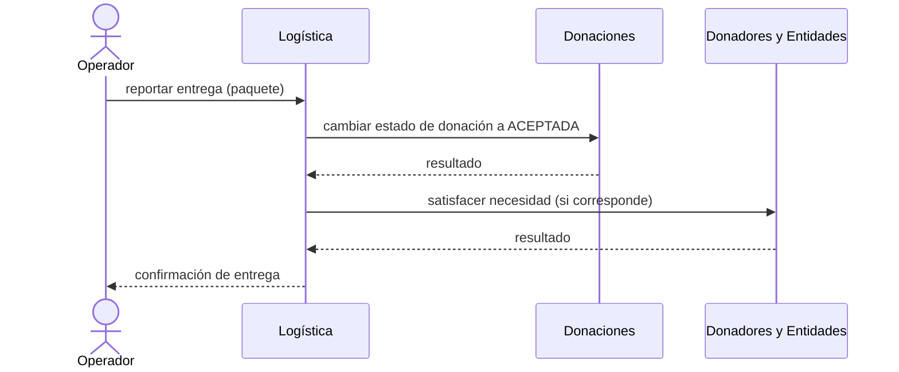
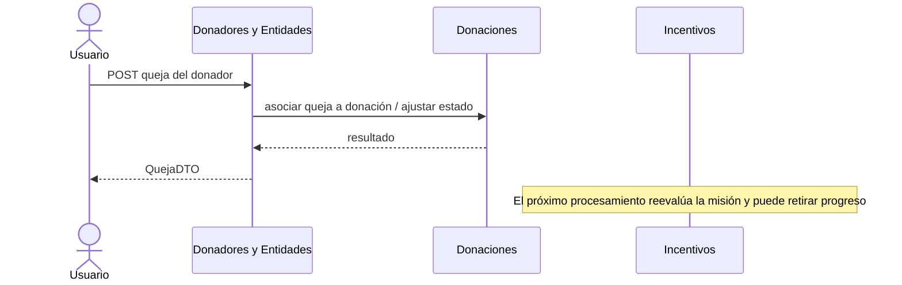
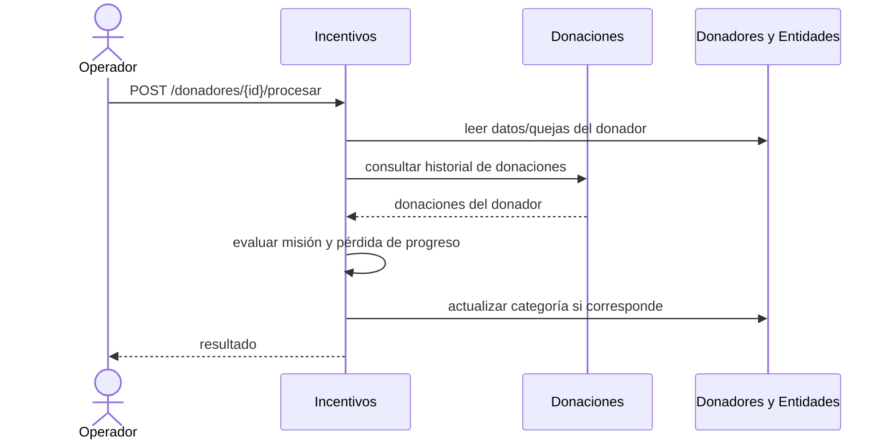
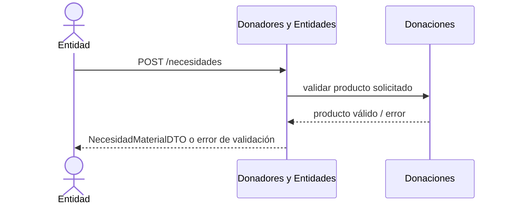
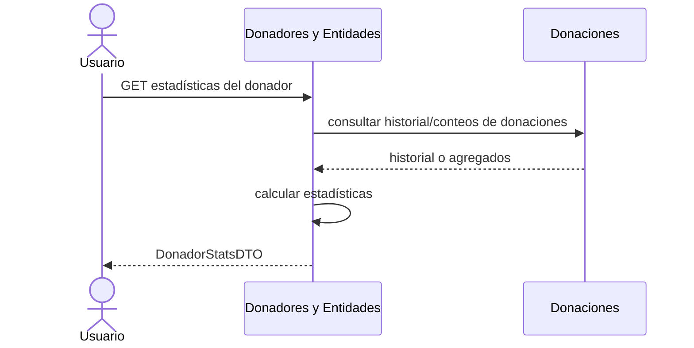

# Entrega 5 — Secuencias integradas (vista preliminar)

Los diagramas muestran los contratos a nivel de servicio descritos en la consigna y la documentación disponible. Las partes internas de Donaciones, Donadores y Entidades y Logística deben validarse con sus repositorios/equipos antes de considerar estos flujos demostrados.

## 1. Realizar una donación

## 2. Reportar la entrega de un paquete

## 3. Registrar queja sobre una donación entregada

## 4. Procesar un donador (Incentivos)

## 5. Registrar una nueva necesidad

## 6. Obtener estadísticas de un donador

> Estos diagramas son un punto de partida contractual derivado de la consigna y docs de Entrega 4. Ajustar los mensajes/rutas internos luego de confirmar OpenAPI y código de los cuatro servicios.
